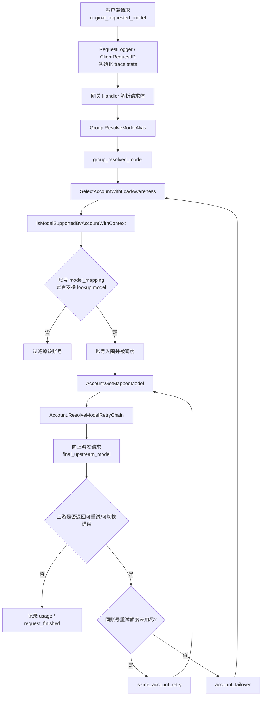
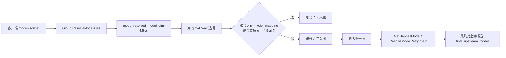

# 请求追踪与模型匹配链路说明

Date: 2026-04-04

Author: Codex

## 1. 目的

本文回答 3 个具体问题：

1. 客户端传入的模型名，如何经过分组改写、账号支持判断、账号内映射、同账号重试和换账号 failover。
2. 为什么 `sonnet` 在分组里被改成 `glm-4.5-air` 后，后续查找的是“谁支持 `glm-4.5-air`”，而不是“谁支持 `sonnet`”。
3. 已拿到某个请求标识后，如何在系统里追到完整请求路径。

## 2. 核心术语

- `original_requested_model`
  客户端请求体里原始的 `model`。
- `group_resolved_model`
  经过分组别名或分组兜底模型后的模型值。
- `account_support_lookup_model`
  账号入围判断时真正拿来匹配账号配置的模型值。当前实现里它等于 `group_resolved_model`。
- `final_upstream_model`
  进入具体账号后，经过账号级 `model_mapping` 和 `model_fallbacks` 后最终发给上游的模型值。
- `client_request_id`
  系统内部主关联键，也是 `ops_request_traces` 的主键。
- `local_request_id`
  入口中间件写入和返回给客户端的 `X-Request-ID`。
- `usage_request_id`
  usage 侧最终落库的请求标识。
- `upstream_request_id`
  上游供应商返回的 request id。一次请求可能有多个。

## 3. 真实执行链路



## 4. 代码落点

### 4.1 请求入口与分组改写

- `backend/internal/server/middleware/request_logger.go`
  注入 `local_request_id`，并初始化 request trace state。
- `backend/internal/server/middleware/client_request_id.go`
  注入 `client_request_id`，并把它写入同一个 trace state。
- `backend/internal/handler/gateway_handler.go`
- `backend/internal/handler/gateway_handler_chat_completions.go`
- `backend/internal/handler/gateway_handler_responses.go`
- `backend/internal/handler/openai_gateway_handler.go`
- `backend/internal/handler/openai_chat_completions.go`
- `backend/internal/handler/sora_gateway_handler.go`

这些入口都会先调用 `startRequestTraceFromGin(...)`，随后在分组存在时执行 `Group.ResolveModelAlias(...)`，若模型名发生变化，再调用 `recordGroupResolved(...)`。

分组模型改写的真实规则在 `backend/internal/service/group.go`：

- 精确别名优先。
- 通配符别名次之，按最长前缀优先。
- 都不命中时，如果分组配置了 `FallbackModel`，直接返回兜底模型。
- 否则保留原始模型名。

### 4.2 选号与账号支持判断

Anthropic/Gemini 主链路最终会进入：

- `backend/internal/service/gateway_service.go`
  `SelectAccountWithLoadAwareness(...)`
- `backend/internal/service/openai_gateway_service.go`
  `SelectAccountWithLoadAwareness(...)`

在候选账号过滤过程中，会调用：

- `backend/internal/service/account.go`
  `IsModelSupported(...)`

判断规则很直接：

- 账号未配置 `credentials.model_mapping` 时，视为“支持全部模型”。
- 配置了 `credentials.model_mapping` 时，只看 key 是否支持当前 lookup model。
- 支持精确 key 和 `*` 后缀通配符。
- Gemini / Antigravity 会先做少量 lookup normalization，再匹配。

这意味着：

- 如果当前 lookup model 已经是 `glm-4.5-air`，那只有支持 `glm-4.5-air` 或 `glm-*` 的账号会入围。
- 某账号仅配置 `sonnet -> glm-4.5-air`，但没有 `glm-4.5-air` 相关 key 时，它不会因为“能把 sonnet 映射成 glm”而入围 `glm-4.5-air` 的选号。

这正是“白名单/映射二选一”下最容易误解的地方：**选号看的是当前 lookup model 是否被账号支持，不是看账号能不能把更早的别名再映射一遍。**

### 4.3 账号内映射与模型 fallback

进入具体账号后，才执行账号级模型变换：

- `backend/internal/service/account.go`
  `GetMappedModel(...)`
- `backend/internal/service/account.go`
  `ResolveModelRetryChain(...)`

执行顺序：

1. 先用 `GetMappedModel(...)` 把当前模型映射成真正要打上游的模型。
2. 再用 `model_fallbacks` 生成同账号内的模型重试链。
3. 同账号模型重试耗尽后，若错误被包装为 failover，可进入换账号逻辑。

所以：

- `group_resolved_model` 决定“哪些账号有资格被选中”。
- `final_upstream_model` 决定“当前被选中的这个账号，最终对上游实际发了什么模型”。

### 4.4 同账号重试与换账号 failover

`backend/internal/handler/failover_loop.go` 会记录两类关键事件：

- `same_account_retry`
  同一个账号内继续尝试。
- `account_failover`
  当前账号被排除，重新回到选号流程。

也就是说，failover 不是从账号内映射直接跳出来的，它一定是“当前账号执行失败后，由 failover loop 再次回到选号逻辑”。

## 5. 例子：`sonnet` 在分组 2 命中兜底变成 `glm-4.5-air`



对这个例子的结论：

1. 客户端请求的是 `sonnet`。
2. 分组 2 把它改成 `glm-4.5-air`。
3. 后续查账号时，查的是“谁支持 `glm-4.5-air`”。
4. 进入具体账号后，还可以继续把 `glm-4.5-air` 映射成别的上游模型。
5. 如果当前账号失败并触发 failover，新的账号选择仍然基于 `glm-4.5-air`，不是回到 `sonnet`。

## 6. 请求追踪是如何落库的

### 6.1 事件采集

`backend/internal/handler/request_trace_helper.go` 当前已接入这些关键事件：

- `request_received`
- `group_model_resolved`
- `selection_started`
- `selection_result`
- `same_account_retry`
- `account_failover`
- `upstream_attempt`
- `request_finished`

### 6.2 统一 finalize

请求结束后，`backend/internal/handler/ops_error_logger.go` 会调用：

- `buildFinalRequestTrace(...)`
- `OpsService.FinalizeAndEnqueueRequestTrace(...)`

这里会统一补齐：

- `finished_at`
- `duration_ms`
- `final_status_code`
- `status`
- `platform`
- `inbound_endpoint`
- `upstream_endpoint`
- `final_account_id`
- `final_upstream_model`
- `upstream_request_ids`

最终异步写入：

- `backend/internal/repository/ops_repo_request_trace.go`
  `UpsertRequestTrace(...)`

落表目标是 `ops_request_traces`，主键是 `client_request_id`。

## 7. 按请求 ID 追踪全路径

### 7.1 支持哪些 key

后端接口：

- `GET /api/v1/admin/ops/request-trace?key=...&key_type=...`

`key_type` 支持：

- `auto`
- `client_request_id`
- `local_request_id`
- `usage_request_id`
- `upstream_request_id`

### 7.2 auto 查询顺序

`auto` 的真实顺序在 `backend/internal/service/ops_request_trace_models.go`：

1. `client_request_id`
2. `local_request_id`
3. `usage_request_id`
4. `upstream_request_id`

### 7.3 多条命中时的行为

如果同一个查询值命中了多条 trace：

- 接口返回 `409`
- 错误码是 `ambiguous_request_identifier`
- 返回 candidate 列表，当前包含：
  - `client_request_id`
  - `created_at`
  - `status`
  - `final_account_id`

前端 trace 弹窗会先展示这些 candidates，再允许继续查看其中一条。

## 8. UI 使用方式

当前已有两个入口：

1. 运维页请求明细
   - `Ops Dashboard -> 请求明细 -> 查看链路`
2. 运维页错误详情
   - `错误详情 -> 追踪请求`

前端文件：

- `frontend/src/views/admin/ops/components/OpsRequestDetailsModal.vue`
- `frontend/src/views/admin/ops/components/OpsErrorDetailModal.vue`
- `frontend/src/views/admin/ops/components/OpsRequestTraceModal.vue`

trace 弹窗当前可看到：

- 请求标识集合
- 4 个模型身份
- 请求摘要
- 最终结果
- 事件时间线

## 9. 运维排查建议

### 9.1 要确认“为什么选中了这个账号”

优先看 timeline 里的：

- `group_model_resolved`
- `selection_started`
- `selection_result`

### 9.2 要确认“为什么最后打成了另一个模型”

优先看：

- `models.group_resolved_model`
- `models.account_support_lookup_model`
- `models.final_upstream_model`

### 9.3 要确认“为什么换账号了”

优先看：

- `same_account_retry`
- `account_failover`
- `upstream_attempt`

### 9.4 要从上游报错回查到整条链路

优先拿到：

- `upstream_request_id`

然后直接用：

```text
/api/v1/admin/ops/request-trace?key=<upstream_request_id>&key_type=upstream_request_id
```

如果只有 `X-Request-ID`，就查：

```text
/api/v1/admin/ops/request-trace?key=<local_request_id>&key_type=local_request_id
```

## 10. 当前边界

当前 trace 已经足够回答“模型是怎么变的、账号是怎么选的、何时触发 failover”。

尚未完全展开的部分：

- `usage` 里还没有 token / billing 细节
- `upstream_request_ids` 目前只保留有限条数
- 还未把所有网关入口都接入同一套 trace helper
- 候选账号的完整过滤原因还未完整落时间线，只保留了关键事件和结果
