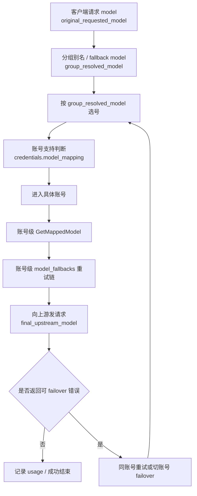
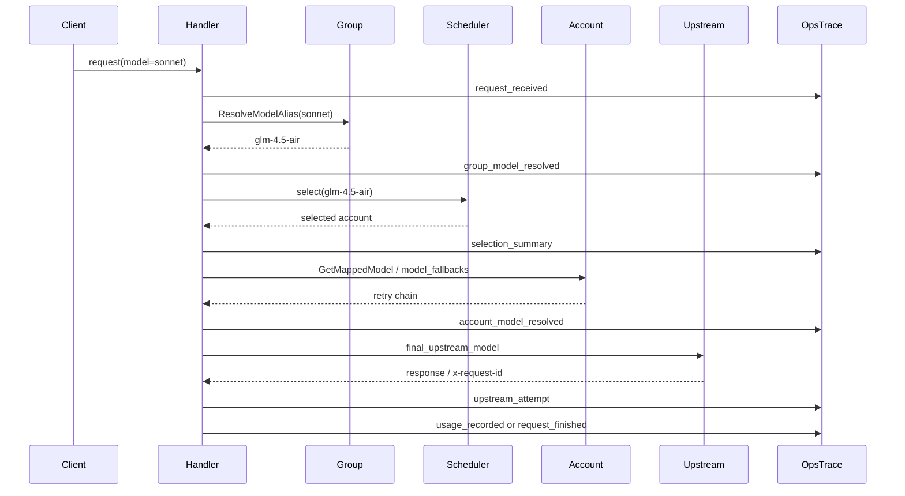

# 模型路由、账号限制编辑与请求全链路追踪设计

Date: 2026-04-03

Author: Codex

## Summary

本设计合并 3 个彼此耦合的子问题：

1. 明确客户端模型名在分组改写、账号支持判断、账号内映射、故障转移中的真实流转语义。
2. 在不引入第二套配置结构的前提下，增强账号管理中的模型限制编辑体验，并在列表中显示当前实际限制摘要。
3. 为每个请求补一条可按任意请求标识反查的结构化 Trace，完整展示模型改写、选号、账号内 fallback、换账号 failover、上游 request id 和最终结果。

这 3 部分必须一起设计，因为：

- 列表展示字段依赖第 1 部分的术语边界。
- Trace 要记录哪些模型字段，取决于第 1 部分的模型流转定义。
- 第 2 部分仍沿用 `credentials.model_mapping`，因此不能把“白名单”和“映射”设计成两套独立概念。

## Goals

- 让 `sonnet -> glm-4.5-air` 这类场景的行为可预测、可解释、可追踪。
- 让创建账号、编辑账号、批量编辑账号都支持整块复制粘贴模型限制。
- 在账号列表里直接看出当前账号是“白名单”还是“映射”，并支持列设置开关。
- 支持通过 `request_id`、`client_request_id`、usage 侧记账 request id、任一 `upstream_request_id` 追踪同一条请求全路径。
- 复用现有 Ops 请求明细视图，不平行再造一套运维模块。

## Non-Goals

- 不新增独立的 `model_whitelist` 存储结构。
- 不重写现有调度算法、负载感知策略或 failover 规则。
- 不把现有 `OpsRequestDetailsModal` 替换成全新页面。
- 不采用“每个 hop 单独落一行”的高写放大 Trace 方案。
- 不在 v1 中记录所有候选账号的完整明细，只记录足够解释决策的摘要。
- 不在 v1 中引入 `request_payload_hash` 或请求体去重能力。

## Canonical Terms

本设计统一使用以下术语：

- `original_requested_model`
  客户端请求体里原始的 `model` 值。
- `group_resolved_model`
  经过分组别名或分组 fallback model 改写后的模型值。选号必须基于这个值。
- `account_support_lookup_model`
  账号支持判断时实际使用的模型值。v1 中它等于 `group_resolved_model`。
- `final_upstream_model`
  进入具体账号后，经过账号级 `model_mapping` 和 `model_fallbacks` 后真正发给上游的模型值。
- `client_request_id`
  系统内部为每个请求自动生成的稳定主关联键。
- `local_request_id`
  入口中间件写入的 `X-Request-ID`。
- `usage_request_id`
  usage/billing 侧最终落库的 request id。当前实现可能是 `client:...` 或 `local:...` 前缀值。
- `upstream_request_id`
  上游供应商响应头返回的 request id。一个请求可能产生多个。

## Part 1: 模型匹配与故障转移语义

### Canonical Flow



### Behavioral Contract

1. 分组改写先于选号。
   `Group.ResolveModelAlias` 必须在账号选择前执行，`SelectAccountWithLoadAwareness` 看到的是 `group_resolved_model`，不是客户端原始模型名。

2. 账号支持判断只看当前 lookup model。
   账号能否入围，取决于它的 `credentials.model_mapping` 是否支持 `account_support_lookup_model`。如果当前 lookup model 是 `glm-4.5-air`，那么只有 `glm-4.5-air`、`glm-*` 等规则才能让账号入围。

3. “能把 sonnet 映射到 glm-4.5-air”不等于“支持 glm-4.5-air 选号”。
   如果某账号只有 `sonnet -> glm-4.5-air` 规则，但没有 `glm-4.5-air` 或通配支持规则，那么它在 `glm-4.5-air` 选号阶段不应入围。

4. 账号内映射与换账号 failover 是两层行为。
   `GetMappedModel` 和 `model_fallbacks` 是同账号内部切模型，不代表换账号。只有 service 返回 `UpstreamFailoverError` 后，handler 才进入同账号重试或切账号 failover。

5. 成功链路和失败链路都必须能还原 4 个模型身份。
   至少要能看到：
   `original_requested_model`
   `group_resolved_model`
   `account_support_lookup_model`
   `final_upstream_model`

### Example: `sonnet -> glm-4.5-air`

1. 客户端请求 `sonnet`。
2. 分组 2 未命中更具体别名时，fallback model 把它改成 `glm-4.5-air`。
3. 选号阶段查找“谁支持 `glm-4.5-air`”。
4. 进入具体账号后，如果该账号还配置了 `glm-4.5-air -> glm-4.5-air-128k` 或 `model_fallbacks`，再继续在账号内切模型。
5. 只有当前账号内部重试耗尽并返回 `UpstreamFailoverError`，才会切到下一个账号。

## Part 2: 账号管理 UI

### Design Principles

- 保持“白名单 / 映射二选一”模式不变。
- 不引入第二套隐藏状态或新的后台字段。
- 批量粘贴增强现有编辑器，不新开独立弹窗。
- 创建、编辑、批量编辑三处共用同一套解析逻辑。

### Canonical UI Behavior

#### 1. 白名单模式批量粘贴

白名单模式新增“批量粘贴模型”入口，支持以下输入：

- 每行一个模型
- 逗号分隔
- 空格分隔
- 混合换行与逗号

解析规则：

- 去掉首尾空白
- 丢弃空行和空 token
- 保持首次出现顺序
- 去重
- 解析结果直接回填到现有 `ModelWhitelistSelector` 绑定数组

#### 2. 映射模式批量粘贴

映射模式新增“批量粘贴映射”入口，支持以下格式：

- `from -> to`
- `from,to`
- `from<TAB>to`

解析规则：

- 每行只解析一条映射
- `from` 和 `to` 去空白
- `from` 或 `to` 为空则丢弃该行
- 同一个 `from` 重复出现时，以最后一条为准
- 解析结果回填到现有 mapping rows

#### 3. 空值语义

- 白名单模式下空结果代表“支持全部模型”
- 映射模式下空结果同样代表“支持全部模型”
- 序列化时仍统一写到 `credentials.model_mapping`
- 白名单模式继续序列化为 `model -> same model` 的 `key=value` 形式

### List Column Design

账号列表新增一个可开关摘要列：`model_restriction`

显示规则：

- 当前账号是白名单模式时：
  `白名单: model-a, model-b, model-c (+N)`
- 当前账号是映射模式时：
  `映射: from-a -> to-a; from-b -> to-b (+N)`
- 当前账号无模型限制时：
  `全部模型`

摘要规则：

- 最多显示前 3 项，超出部分用 `(+N)` 表示
- 编辑器内部保留用户当前输入顺序，便于继续编辑
- 列表摘要使用稳定排序，不依赖对象插入顺序
- 白名单模式按模型名升序展示
- 映射模式按 `from` 升序展示
- 前端摘要渲染只做显示排序，不改变实际保存值

### Serialization Contract

`credentials.model_mapping` 是 Part 2 唯一使用的持久化字段。

白名单模式序列化规则：

- 统一序列化为 `{"model-a":"model-a","model-b":"model-b"}`
- 只允许精确模型名，不允许通配符
- 任一包含 `*` 的白名单项都视为无效输入，不参与持久化
- 同名模型去重后只保留一条

映射模式序列化规则：

- 统一序列化为 `{"from-a":"to-a","from-b":"to-b"}`
- `from` 允许精确模型或后缀通配符 `*`
- `to` 必须是具体模型名，不允许通配符
- 同一个 `from` 重复出现时，以最后一条为准

反序列化规则：

- `credentials.model_mapping` 缺失或为空对象时，解释为“全部模型”
- 若对象中每一项都满足 `from === to` 且 `from` 不包含 `*`，则解释为白名单模式
- 其他情况一律解释为映射模式

提交规则：

- 创建 / 单账号编辑：
  若解析后结果为空，则删除 `credentials.model_mapping`
- 批量编辑：
  若用户显式启用“模型限制”但解析后结果为空，则提交 `credentials.model_mapping = {}`
  以覆盖已有配置并恢复“全部模型”

列设置规则：

- 复用现有 `hiddenColumns`
- 复用现有 `account-hidden-columns`
- 只增加一个 toggleable column，不拆成“白名单列”和“映射列”两列

这样可以保持和后端真实语义一致：系统只允许一种模型限制模式生效。

### Affected Frontend Areas

- `frontend/src/components/account/ModelWhitelistSelector.vue`
- `frontend/src/components/account/CreateAccountModal.vue`
- `frontend/src/components/account/EditAccountModal.vue`
- `frontend/src/components/account/BulkEditAccountModal.vue`
- `frontend/src/views/admin/AccountsView.vue`
- 相关 i18n 文案和组件测试

## Part 3: 按请求 ID 的全链路追踪

### Existing Gap

现有数据基础并不为零：

- `usage_logs` 已有 `request_id`、`requested_model`、`upstream_model`
- `ops_error_logs` 已有 `request_id`、`client_request_id`、`RequestedModel`、`UpstreamModel`、`UpstreamErrors`
- 中间件已自动注入 `client_request_id` 和 `X-Request-ID`

但它仍无法回答以下问题：

- 这个请求原始模型是什么，分组改写后变成了什么
- 为什么是这个账号入围，不是另一个账号
- 账号内是否发生了 `model_fallbacks`
- 是否发生过同账号重试
- 是否发生过切账号 failover
- 成功请求对应的上游 `request_id` 是哪个

### Recommended Storage

新增一张轻量级请求 Trace 表：`ops_request_traces`

一条请求只落一行，避免热路径写放大。

建议字段：

- `id`
- `created_at`
- `finished_at`
- `duration_ms`
- `status` (`success | error | canceled`)
- `platform`
- `request_path`
- `inbound_endpoint`
- `upstream_endpoint`
- `user_id`
- `api_key_id`
- `group_id`
- `final_account_id`
- `stream`
- `client_request_id` 唯一索引
- `local_request_id`
- `usage_request_id`
- `upstream_request_ids` (`text[]`)
- `original_requested_model`
- `group_resolved_model`
- `account_support_lookup_model`
- `final_upstream_model`
- `final_status_code`
- `trace_events` (`jsonb`)

理由：

- 一行一请求足够满足“按任意 request 标识查询全路径”
- `text[]` 足以保存多个 `upstream_request_id`
- `trace_events jsonb` 能保存时间线，不需要额外的 hop 级明细表

字段语义补充：

- `platform`
  指请求进入调度阶段后最终使用的平台语义，例如 `anthropic | gemini | openai | antigravity`
- `inbound_endpoint`
  指本系统入口能力名，例如 `messages | chat_completions | responses`
- `upstream_endpoint`
  指最终请求发往上游供应商的真实 path 或兼容 path

### Index And Query Strategy

v1 明确采用以下索引与查询策略：

- `client_request_id`：唯一 BTREE 索引
- `local_request_id`：普通 BTREE 索引
- `usage_request_id`：普通 BTREE 索引
- `upstream_request_ids`：GIN 数组索引

按 `upstream_request_id` 反查时，仓储层使用数组包含查询，例如：

- `upstream_request_ids @> ARRAY[$1]::text[]`

因此 v1 不拆 `upstream_request_ids` 子表；如果后续压测证明该查询成为瓶颈，再单独评估拆表。

### Trace Event Model

`trace_events` 中每条事件统一结构：

```json
{
  "ts": "2026-04-03T14:00:00.123Z",
  "type": "group_model_resolved",
  "phase": "routing",
  "summary": "sonnet -> glm-4.5-air",
  "data": {}
}
```

v1 必须覆盖以下事件类型：

- `request_received`
  保存原始模型、路径、是否流式、主请求标识。
- `group_model_resolved`
  保存 `from`、`to`、`reason`（`alias | fallback | passthrough`）。
- `selection_started`
  保存 lookup model、排除账号列表摘要、sticky account 信息。
- `selection_summary`
  保存选中的账号、候选数量、各类过滤计数。
- `account_model_resolved`
  保存账号 id、账号名、账号级映射结果、重试链首项。
- `same_account_model_retry`
  保存当前账号内从哪个模型切到哪个模型、触发原因。
- `same_account_retry`
  保存同账号重试次数、状态码。
- `account_failover`
  保存从哪个账号切出、切换次数、触发原因。
- `upstream_attempt`
  保存实际请求的上游模型、上游 endpoint、`upstream_request_id`。
- `usage_recorded`
  保存 usage 落账 request id、token 摘要、计费模型。
- `request_finished`
  保存最终状态、最终状态码、最终账号、最终上游模型。

除 `summary` 外，v1 各事件的 `data` 至少包含以下关键字段：

- `request_received`
  `original_requested_model`、`request_path`、`stream`
- `group_model_resolved`
  `from`、`to`、`reason`
- `selection_started`
  `lookup_model`、`excluded_account_ids`、`sticky_account_id`
- `selection_summary`
  `selected_account_id`、`candidate_count`、`filtered_counts`
- `account_model_resolved`
  `account_id`、`account_support_lookup_model`、`resolved_primary_model`
- `same_account_model_retry`
  `account_id`、`from_model`、`to_model`
- `same_account_retry`
  `account_id`、`retry_count`、`status_code`
- `account_failover`
  `from_account_id`、`switch_count`、`status_code`
- `upstream_attempt`
  `account_id`、`final_upstream_model`、`upstream_request_id`
- `usage_recorded`
  `usage_request_id`、`billing_model`、`token_summary`
- `request_finished`
  `status`、`final_status_code`、`final_account_id`

### Selection Snapshot Policy

Trace 需要解释“为什么不是另一个账号”，但不应保存所有候选账号的海量细节。

v1 只记录以下摘要：

- 总候选数
- 因 `excludedIDs` 被过滤的数量
- 因 `model_mapping` 不匹配被过滤的数量
  指账号的 `credentials.model_mapping` 对 `account_support_lookup_model` 不支持，因此根本不能入围。
- 因模型级可调度性限制被过滤的数量
  指账号虽然支持该模型，但在当前时刻被 `isAccountSchedulableForModelSelection(...)` 判定为不可调度，例如模型级限流、容量占用或该函数覆盖的平台特定模型门禁。
- 因 quota / window cost / rpm 被过滤的数量
- 最终选中的账号

如果存在显式 model routing，还记录命中的路由账号 ID 列表。

### Request Identity Contract

内部主关联键统一使用 `client_request_id`。

查询时允许使用任意以下标识反查同一条 Trace：

- `client_request_id`
- `local_request_id`
- `usage_request_id`
- 任一 `upstream_request_id`

这解决当前“一个请求有多个 ID，但彼此不互通”的问题。

为避免单个 `key` 命中多类标识时出现不确定性，v1 额外定义：

- 查询接口支持可选参数 `key_type`
  可取 `auto | client_request_id | local_request_id | usage_request_id | upstream_request_id`
- 默认使用 `key_type=auto`
- UI 中裸文案 `request_id` 仅表示“可自动识别的请求标识”，不再单独指代某一种具体 ID
- `auto` 模式按以下顺序精确匹配：
  1. `client_request_id`
  2. `local_request_id`
  3. `usage_request_id`
  4. `upstream_request_ids` 包含查询
- 如果同一层级命中多条记录：
  返回 `409 ambiguous_request_identifier`
- `409` 响应至少返回候选项摘要：
  `client_request_id`、`created_at`、`status`、`final_account_id`
- `409` 的 `candidates` 按 `created_at desc` 排序，最多返回 20 条
- 列表或详情页内的“查看链路”按钮，应优先带明确的 `key_type` 发起查询，避免依赖 `auto`

### Persistence Strategy

推荐做法：

1. 请求开始时在 gin context 中初始化 trace state。
2. 请求处理中不断向 context 追加结构化事件。
3. 成功结束时，在 usage 写入后补 `usage_recorded` 和 `request_finished`。
4. 失败结束时，在错误记录阶段补 `request_finished`。
5. 通过异步 writer 统一写入 `ops_request_traces`。
6. 以 `client_request_id` 做 upsert，避免成功/失败双写或重复 flush。

这一策略不依赖 `LegacyPrintf`，也不要求每个 hop 都立即打数据库。

### Trace Size Guardrails

为避免单行 `jsonb` 过大，v1 增加以下约束：

- `upstream_request_ids` 最多保留前 10 个，超出时附带 `upstream_request_ids_truncated=true` 和 `upstream_request_ids_total`
- 事件 `data` 中的账号 ID 数组最多保留前 20 项，超出时附带 `truncated=true` 和 `total_count`
- 不在 Trace 中保存原始 request/response body
- 重复的同类事件允许聚合成摘要，不要求逐 token / 逐 chunk 记录

### Async Writer Failure Semantics

Trace 写入采用 best-effort 异步策略，但要有最低可观测性保证：

- 异步 writer 使用有界队列，容量做成可配置项
- 队列满时允许丢弃 Trace，但必须记录 `ops_trace_dropped` 结构化日志
- 单次 flush 失败时，异步 writer 最多重试 3 次
- 重试仍失败时，只记录结构化错误日志，不影响主请求响应
- 错误日志至少包含 `client_request_id`、失败阶段、错误消息
- 如果已落部分事件但缺失 `request_finished`，查询接口返回 `trace_incomplete=true`
- 如果整条 Trace 最终未落库，则请求业务仍视为成功，但链路查询会返回 `404`

### API And UI

#### Backend API

新增查询接口：

- `GET /admin/ops/request-trace?key=<request-identifier>&key_type=<optional>`

`200 OK` 返回结构：

```json
{
  "identity": {
    "query_key": "req_123",
    "query_key_type": "auto",
    "matched_by": "usage_request_id",
    "client_request_id": "client:abc",
    "local_request_id": "req_local_1",
    "usage_request_id": "usage_1",
    "upstream_request_ids": ["up_1"],
    "upstream_request_ids_truncated": false,
    "upstream_request_ids_total": 1
  },
  "models": {
    "original_requested_model": "sonnet",
    "group_resolved_model": "glm-4.5-air",
    "account_support_lookup_model": "glm-4.5-air",
    "final_upstream_model": "glm-4.5-air-128k"
  },
  "request": {
    "created_at": "2026-04-03T14:00:00.123Z",
    "finished_at": "2026-04-03T14:00:01.234Z",
    "duration_ms": 1111,
    "status": "success",
    "platform": "anthropic",
    "request_path": "/v1/messages",
    "inbound_endpoint": "messages",
    "upstream_endpoint": "/v1/chat/completions",
    "user_id": 1,
    "api_key_id": 2,
    "group_id": 3,
    "stream": false
  },
  "timeline": [],
  "usage": {
    "usage_request_id": "usage_1",
    "billing_model": "glm-4.5-air-128k",
    "input_tokens": 100,
    "output_tokens": 50,
    "cache_creation_tokens": 0,
    "cache_read_tokens": 0
  },
  "result": {
    "final_status": "success",
    "final_status_code": 200,
    "final_account_id": 123,
    "final_account_name": "account-a",
    "final_upstream_model": "glm-4.5-air-128k"
  },
  "trace_incomplete": false
}
```

`timeline` 中每个事件对象结构固定为：

```json
{
  "ts": "2026-04-03T14:00:00.123Z",
  "type": "selection_summary",
  "phase": "selection",
  "summary": "selected account 123",
  "data": {}
}
```

字段约束：

- `ts` 使用 UTC `RFC3339Nano` 字符串
- `type` 必须来自本设计列出的 v1 事件枚举
- `phase` 取值范围为 `ingress | routing | selection | account | upstream | usage | finish`
- `data` 为对象，字段遵循本设计的最小事件契约

返回契约要求：

- 身份卡必须直接返回 4 个模型身份：
  `original_requested_model`
  `group_resolved_model`
  `account_support_lookup_model`
  `final_upstream_model`
- 当查询结果歧义时，返回 `409`
- 当查无结果时，返回 `404`

`404 Not Found` 返回结构：

```json
{
  "error": {
    "code": "trace_not_found",
    "message": "request trace not found"
  }
}
```

`409 Conflict` 返回结构：

```json
{
  "error": {
    "code": "ambiguous_request_identifier",
    "message": "multiple traces matched the identifier",
    "candidates": [
      {
        "client_request_id": "client:abc",
        "created_at": "2026-04-03T14:00:00.123Z",
        "status": "success",
        "final_account_id": 123
      }
    ]
  }
}
```

#### Frontend UI

现有 `OpsRequestDetailsModal` 保留，新增“查看链路”能力：

- 请求列表中的 request id 增加 `查看链路`
- `OpsErrorDetailModal` 中增加 `查看本次请求链路`
- 新增 `OpsRequestTraceModal.vue` 或等价全宽弹窗

Trace UI 应至少包含：

- 身份卡：`client_request_id`、`X-Request-ID`、`usage_request_id`、所有 `upstream_request_id`
- 模型身份卡：`original_requested_model`、`group_resolved_model`、`account_support_lookup_model`、`final_upstream_model`
- 时间线：按时间展示模型改写、选号、账号内 fallback、failover、usage 落账
- 结果卡：最终账号、最终上游模型、最终状态

## Data Flow



## Acceptance Criteria

### Part 1

- `sonnet -> glm-4.5-air` 场景中，选号使用 `glm-4.5-air`
- 只有 `sonnet -> glm-4.5-air` 的账号不会因为这条映射直接入围 `glm-4.5-air` 选号
- 成功和失败都能展示 4 个模型身份

### Part 2

- 创建、编辑、批量编辑都支持整块粘贴白名单
- 创建、编辑、批量编辑都支持整块粘贴映射
- 空白名单 / 空映射仍表示“全部模型”
- 列表新增 `model_restriction` 摘要列，且可在列设置中开关

### Part 3

- 给定 `client_request_id` 能查到完整时间线
- 给定 `local_request_id` 能查到同一条时间线
- 给定 usage 侧 `request_id` 能查到同一条时间线
- 给定任一 `upstream_request_id` 能查到同一条时间线
- 时间线能看出分组模型改写、账号选择、账号内 fallback、切账号 failover

## Verification

### Backend

- 单元测试：模型术语与 Trace 事件构建
- 仓储测试：`ops_request_traces` 写入与按多种 key 查询
- handler/service 集成测试：成功链路、失败链路、同账号 fallback、切账号 failover

### Frontend

- 组件测试：白名单批量粘贴解析
- 组件测试：映射批量粘贴解析
- 组件测试：`model_restriction` 列摘要渲染
- 组件测试：Trace 弹窗按不同 request 标识打开

### Manual

- 通过账号配置重现 `sonnet -> glm-4.5-air`
- 手动制造一次同账号 `model_fallbacks`
- 手动制造一次切账号 failover
- 在 Ops 中分别用 4 种 request 标识反查同一条请求

## Files Likely To Change

### Backend

- `backend/internal/handler/gateway_handler.go`
- `backend/internal/handler/openai_gateway_handler.go`
- `backend/internal/handler/gateway_handler_chat_completions.go`
- `backend/internal/handler/gateway_handler_responses.go`
- `backend/internal/handler/ops_error_logger.go`
- `backend/internal/handler/failover_loop.go`
- `backend/internal/service/gateway_service.go`
- `backend/internal/service/openai_gateway_service.go`
- `backend/internal/service/account.go`
- `backend/internal/service/ops_request_details.go`
- 新增 Trace service / repository / migration

### Frontend

- `frontend/src/components/account/ModelWhitelistSelector.vue`
- `frontend/src/components/account/CreateAccountModal.vue`
- `frontend/src/components/account/EditAccountModal.vue`
- `frontend/src/components/account/BulkEditAccountModal.vue`
- `frontend/src/views/admin/AccountsView.vue`
- `frontend/src/views/admin/ops/components/OpsRequestDetailsModal.vue`
- 新增 `frontend/src/views/admin/ops/components/OpsRequestTraceModal.vue`
- `frontend/src/api/admin/ops.ts`
- 相关 i18n 与测试文件

## Rollout Order

推荐顺序保持为：

1. 先落 Part 1 的术语、字段和链路埋点边界。
2. 再落 Part 3 的 Trace 存储与查询接口。
3. 最后落 Part 2 的账号管理编辑体验与列表展示。

这样可以保证 UI 文案和 Trace 字段都建立在同一套模型语义上，避免返工。
